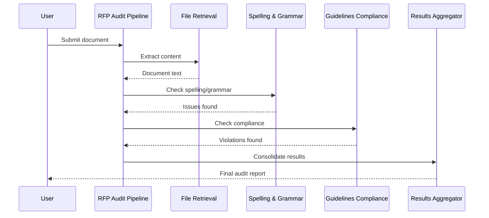

# RFP Auditor Agent

## Table of Contents
1. [Overview](#overview)
2. [Setup](#setup)
3. [Testing](#testing)
4. [Architecture](#architecture)

## Overview

An ADK-powered, multi-agent RFP auditor. The system uses a multi-stage pipeline with four specialized agents for comprehensive document review: spelling/grammar, guidelines compliance, and result aggregation. Includes a script for Agentspace deployment via Agent Engine.

### Key Features
- **Multi-Agent Pipeline**: Four specialized agents working sequentially
- **RFP-Specific Design**: Optimized for RFP terminology
- **Guidelines Compliance**: Rule-based checking against writing and regulatory standards
- **Quality Assurance**: Multi-pass validation with duplicate detection

### Technology Stack
- **Backend**: Python with Google Cloud services
- **AI/ML**: Google Vertex AI with Gemini 2.5 Pro
- **Framework**: Google ADK (Agent Development Kit)
- **Deployment**: Google Cloud AgentSpace via Agent Engine

## Setup

### Prerequisites
- Google Cloud SDK
- Python 3.13+ with UV package manager
- A Google Cloud Project
- A Google Cloud Storage Bucket for Agent Engine Deployment Staging (optional, but required for AS deployment)
- An Agentspace Instance (optional, but required for AS deployment)
- The following APIs Enabled: aiplatform.googleapis.com and discoveryengine.googleapis.com
- The following GCP Roles: roles/aiplatform.admin roles/storage.objects.get

### Quick Start
1a. **Clone this repository and install requirements**
```bash
    cd adk-rfp-agent
    uv sync
    source .venv/bin/activate
```
 1b.  **Configure gcloud auth and project**
```bash
    gcloud auth application-default login
    gcloud auth application-default set-quota-project <project-id>
```

2. **Create a .env file in the /auditor_agent directory**
There is an .env.example file. Rename the file to .env and update each of the variables in the file according to the details of your environment.
This supports cross project deployment, e.g. deploy to a staging environment porject (Agent Engine),  and expose that agent in another project (Agentspace project).

3. **Deployment to Agentspace**
   ```bash
   cd adk-rfp-agent
   python -m scripts.deploy_to_agentspace
   ```

### Project Structure
```
adk-rfp-agent/
├── auditor_agent/           # Main agent implementation
│   ├── agent.py            # Core logic
│   ├── model.py            # Data models
│   ├── guidelines/         # JSON rule files
│   └── prompts/           # YAML configurations
└── scripts/               # Automation scripts
```

## Testing

### AgentSpace UI (After Deployment)
1. Navigate to AgentSpace in Google Cloud Console
2. Upload documents through the UI
3. Review audit results

### Command Line (Local Development/Testing)
```bash
cd src
adk web
```
Starts local web server to upload documents and test the pipeline.

## Architecture

### Agent Pipeline



### Core Agents

1. **File Retrieval Agent**
   - Loads and extracts document content
   - Uses ADK `load_artifacts` tool

2. **Spelling & Grammar Agent**
   - Character-level precision checking
   - Validates punctuation and structure
   - Checks terminology consistency

3. **Guidelines Compliance Agent**
   - Applies writing and regulatory rules
   - Uses structured JSON guidelines
   - Provides specific rule ID violations

4. **Audit Results Aggregator**
   - Merges results from previous agents
   - Resolves duplicates and contradictions
   - Formats final output

### Data Models

**DocumentCorrection**
- `correction_number`: Sequential ID
- `specific_location`: Document location
- `text_before_revision`: Original text
- `text_after_revision`: Corrected text
- `reason_for_revision`: Explanation
- `violation_category`: Error type
- `rule_id`: Guideline rule reference
- `severity`: Priority level

**DocumentAuditResult**
- `corrections`: List of DocumentCorrection objects

### Technical Details
- **Model**: Gemini 2.5 Pro (temperature: 0, seed: 5)
- **Configuration**: YAML prompts, JSON guidelines
- **Framework**: Google ADK with SequentialAgent
- **Output**: Structured JSON with Pydantic validation

### Troubleshooting
- **Authentication**: Verify GCP credentials
- **Permissions**: Check IAM roles
- **Quotas**: Monitor Vertex AI limits
- **Paths**: Verify GCS and local file paths